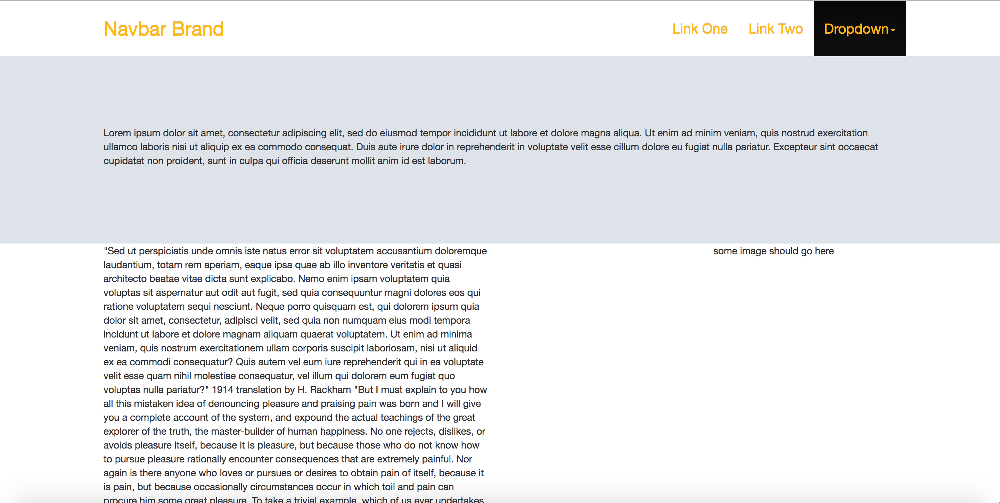
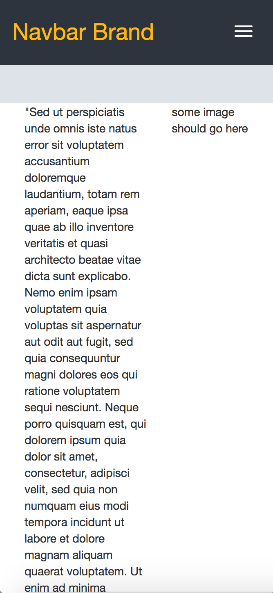
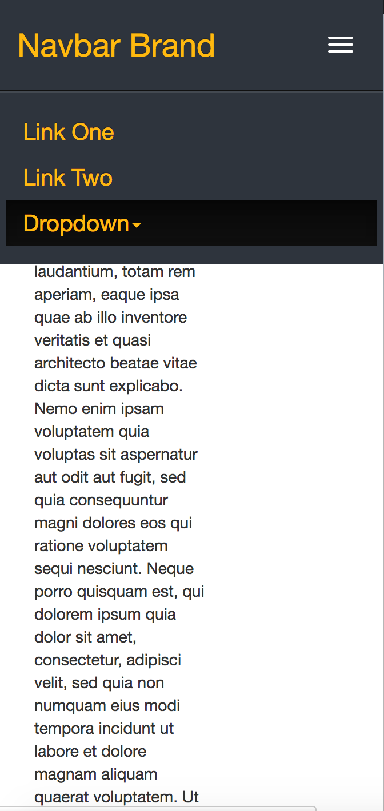

# React-LinearPage
A quick implementation of a single-page layout generated from React.js. Includes scrolling navbar that changes color after a certain scroll distance

 
 

  <h2>In this screenshot, the navbar is white which is its default color</h2>
  

   
   
   
  <h2>After scrolling down a specified limit, the navbar changes to black</h2>
  

   
   
   
  <h2>Example showcasing the page on mobile devices</h2>
  

   
   
   
  <h2>Opening the navbar-collapse toggle button on mobile devices</h2>
  

